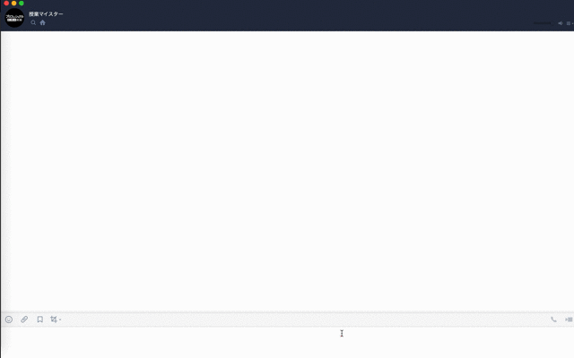

# DEMO

# OVERVIEW

If you send a day of the week, it will return a timetable for that day. It also teaches the next classroom. Timetable data is in json format (class.json).

[LINE Official Account Manager](https://manager.line.biz/)

# REFERENCE

[1時間でLINE BOTを作るハンズオン (資料+レポート) in Node学園祭2017 #nodefest](https://qiita.com/n0bisuke/items/ceaa09ef8898bee8369d)
